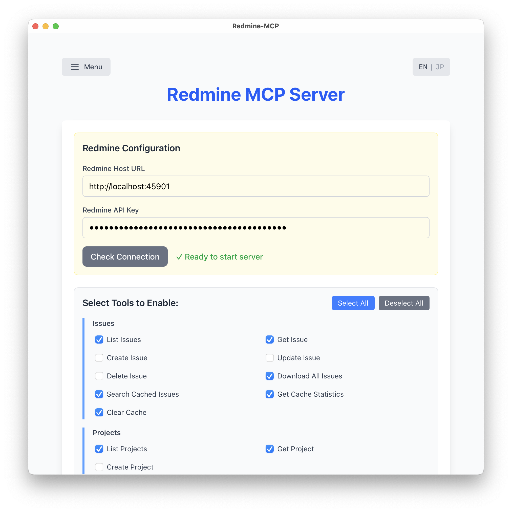

# Redmine MCP

Redmine MCP Server - A desktop application that provides Redmine API access through the Model Context Protocol (MCP), built with Tauri, React, and Rust.



The Redmine MCP dashboard provides an intuitive interface for managing your MCP server. Configure your Redmine connection, select which tools to enable, and start the server for AI-powered Redmine interactions.

## 🚀 Features

### Core Features
- **MCP Server**: Streamable HTTP server using Axum on configurable port (default: 37650)
- **Redmine Integration**: Full access to Redmine API for issues, projects, users, and time tracking
- **Journal Support**: Complete issue history tracking with comments and field changes
- **Persistent Configuration**: Securely stores Redmine settings locally (~/.redmine-mcp/config.json)
- **Secure Configuration**: API key authentication with connection testing
- **Cross-Platform**: Works on macOS, Windows, and Linux

### Advanced Features 🎉
- **Tool Selection UI**: Choose which MCP tools to enable before starting the server
- **Tool Categories**: Tools organized into logical groups (Issues, Projects, Users, Time Entries)
- **Safety First**: Create and Update operations disabled by default
- **Visual Feedback**: See enabled tools even when server is running
- **Local SQLite Cache**: Store Redmine data locally for offline access and performance
- **Cache Management**: 
  - Statistics modal for viewing cached data counts
  - Menu-based controls in top-left corner
  - Auto-clear cache when switching Redmine servers
  - Full-text search with pagination support
- **Connection Management**:
  - Timeout protection (10s backend, 15s frontend)
  - Auto-reset status when credentials change
  - Detailed error messages for troubleshooting
- **Internationalization**: Full English and Japanese language support
- **Modern UI**: React-based interface with Tailwind CSS v4 styling

## 📋 Prerequisites

- Node.js (v16 or higher)
- Rust (latest stable)
- npm/pnpm/yarn
- A Redmine server with API access enabled
- Your Redmine API key (found in your account settings)

## 🛠️ Installation

1. Clone the repository:

```bash
git clone https://github.com/yonaka15/redmine-mcp.git
cd redmine-mcp
```

2. Install dependencies:

```bash
npm install
```

3. Start the development server:

```bash
npm run tauri dev
```

## 🎮 Usage

### Setting up Redmine Connection

1. **Get your Redmine API key**:
   - Log into your Redmine instance
   - Go to "My account" (usually in top-right menu)
   - Find your API access key on the right side of the page
   - If no key exists, click "Show" under "API access key"

2. **Configure in the app**:
   - Enter your Redmine server URL (e.g., `https://redmine.example.com`)
   - Enter your API key
   - Click "Check Connection" to verify
   - Select which tools you want to enable (optional)
   - Once verified, start the MCP server

### Tool Selection

The application provides granular control over which tools are exposed through the MCP server:

- **Issues**: List, Get, Create*, Update*, Delete operations
- **Projects**: List, Get, Create operations
- **Users**: List, Get current user
- **Time Entries**: List, Create
- **Cache Tools**: Download All Issues, Search Cached Issues, Get Stats, Clear Cache (enabled by default)

*Create and Update issue operations are disabled by default for safety.

### Local Cache Management

The application includes a powerful SQLite-based local cache system:

#### Cache Features
- **Automatic Database Initialization**: SQLite database created automatically on first launch
- **Paginated Download**: Downloads all issues in batches of 100 for efficiency
- **Full-Text Search**: Search cached issues with pagination support (limit/offset)
- **Filter Support**: Filter by project, status, and assignee
- **Statistics Modal**: View cache statistics in a clean modal interface
- **Menu Controls**: Access cache operations via dropdown menu in top-left corner
- **Auto-Clear**: Cache automatically cleared when switching Redmine servers

#### Cache Location
The SQLite database is stored at:
- **macOS/Linux**: `~/.redmine-mcp/cache.db`
- **Windows**: `%USERPROFILE%\.redmine-mcp\cache.db`

#### Cache Operations via MCP Tools
- **redmine_download_all_issues**: Download and cache all issues (with progress pagination)
- **redmine_search_cached_issues**: Search with query, filters, limit, and offset parameters
- **redmine_get_cache_stats**: Get current cache statistics
- **redmine_clear_cache**: Remove all cached data

### Running as MCP Server

The application runs as an MCP Streamable HTTP server using Axum:

```bash
cargo run --release --manifest-path src-tauri/Cargo.toml
```

The server runs on port 37650 and provides:
- HTTP POST endpoint for JSON-RPC 2.0 requests
- HTTP GET endpoint for Server-Sent Events (SSE) streaming
- Session management via default session

### Connect with Claude Code

```bash
claude mcp add --transport http redmine http://localhost:37650/mcp
```

### Connect with Claude Desktop

Add to your Claude Desktop configuration:

```json
{
  "redmine": {
    "command": "npx",
    "args": [
      "-y",
      "mcp-remote",
      "http://localhost:37650/mcp"
    ]
  }
}
```

### Connect with VS Code

```bash
code --add-mcp "{\"name\":\"redmine\",\"url\":\"http://localhost:37650/mcp\"}"
```

## 🔧 Available MCP Tools

**Note**: `redmine_configure` and `redmine_test_connection` have been removed as configuration is handled through the Tauri application UI.

### Issue Management

#### redmine_list_issues
List Redmine issues with filtering options.

**Parameters:**
- `project_id` (string): Project ID or identifier
- `assigned_to_id` (string): User ID of assignee
- `status_id` (string): Status ID
- `tracker_id` (string): Tracker ID
- `limit` (number): Maximum results (default: 25)
- `offset` (number): Pagination offset

#### redmine_get_issue
Get a specific issue by ID with full journal history.

**Parameters:**
- `id` (number, required): Issue ID

**Returns:**
- Issue details including attachments and journals (comments/history)

#### redmine_create_issue (Disabled by default)
Create a new issue.

**Parameters:**
- `project_id` (string, required): Project ID or identifier
- `subject` (string, required): Issue subject
- `description` (string): Issue description
- `tracker_id` (number): Tracker ID
- `status_id` (number): Status ID
- `priority_id` (number): Priority ID
- `assigned_to_id` (number): Assignee user ID
- `parent_issue_id` (number): Parent issue ID
- `start_date` (string): Start date (YYYY-MM-DD)
- `due_date` (string): Due date (YYYY-MM-DD)
- `estimated_hours` (number): Estimated hours

#### redmine_update_issue (Disabled by default)
Update an existing issue.

**Parameters:**
- `id` (number, required): Issue ID
- `subject` (string): New subject
- `description` (string): New description
- `status_id` (number): New status ID
- `priority_id` (number): New priority ID
- `assigned_to_id` (number): New assignee ID
- `done_ratio` (number): Progress (0-100)
- `notes` (string): Update notes/comment

#### redmine_delete_issue
Delete an issue.

**Parameters:**
- `issueNumber` (number, required): Issue ID

### Project Management

#### redmine_list_projects
List all projects.

**Parameters:**
- `limit` (number): Maximum results (default: 25)
- `offset` (number): Pagination offset

#### redmine_get_project
Get a specific project.

**Parameters:**
- `id` (string, required): Project ID or identifier

#### redmine_create_project
Create a new project.

**Parameters:**
- `name` (string, required): Project name
- `identifier` (string, required): Unique identifier
- `description` (string): Project description
- `parent_id` (number): Parent project ID
- `is_public` (boolean): Public visibility (default: false)

### User Management

#### redmine_list_users
List users.

**Parameters:**
- `status` (number): User status (1=active, 2=registered, 3=locked)
- `name` (string): Filter by name
- `limit` (number): Maximum results (default: 25)
- `offset` (number): Pagination offset

#### redmine_get_current_user
Get the current API user's information.

### Time Tracking

#### redmine_list_time_entries
List time entries.

**Parameters:**
- `issue_id` (number): Filter by issue ID
- `project_id` (string): Filter by project ID
- `user_id` (number): Filter by user ID
- `from` (string): From date (YYYY-MM-DD)
- `to` (string): To date (YYYY-MM-DD)
- `limit` (number): Maximum results (default: 25)

#### redmine_create_time_entry
Create a time entry.

**Parameters:**
- `hours` (number, required): Hours spent
- `issue_id` (number): Issue ID
- `project_id` (string): Project ID (required if issue_id not provided)
- `activity_id` (number): Activity ID
- `comments` (string): Comments
- `spent_on` (string): Date (YYYY-MM-DD)

### Cache Management

#### redmine_download_all_issues
Download all issues from Redmine and cache them locally.

**Returns:**
- Success message with total number of cached issues

#### redmine_search_cached_issues
Search locally cached issues with full-text search and filters.

**Parameters:**
- `query` (string, required): Search query for subject and description
- `project_id` (number): Filter by project ID
- `status_id` (number): Filter by status ID
- `assigned_to_id` (number): Filter by assignee ID
- `limit` (number): Maximum results per page (default: 100)
- `offset` (number): Number of results to skip for pagination (default: 0)

**Returns:**
- List of matching issues with pagination info

#### redmine_get_cache_stats
Get statistics about locally cached data.

**Returns:**
- Count of cached issues (projects, users, time_entries currently not used)

#### redmine_clear_cache
Clear all locally cached data.

**Returns:**
- Success confirmation message

## 🏗️ Tech Stack

### Frontend

- **React 19** - UI framework
- **TypeScript** - Type safety
- **Tailwind CSS v4** - Styling
- **Vite** - Build tool
- **@tauri-apps/api** - Tauri integration

### Backend

- **Rust** - Core backend language
- **Tauri v2** - Desktop application framework
- **Axum** - Web framework for MCP Streamable HTTP server
- **Reqwest** - HTTP client for Redmine API
- **Rusqlite** - SQLite database for local caching
- **Tokio** - Async runtime
- **Tower-http** - CORS and middleware support

### Protocol

- **MCP Streamable HTTP** - HTTP/SSE transport with Axum
- **JSON-RPC 2.0** - Message format
- **Server-Sent Events (SSE)** - Real-time server-to-client streaming
- **Redmine REST API** - Issue tracking system API

## 📁 Project Structure

```
redmine-mcp/
├── src/                      # React frontend
│   ├── App.tsx              # Main UI with Redmine config & MCP controls
│   ├── App.css              # Tailwind CSS styles
│   ├── i18n.ts              # Language translations (EN/JP)
│   └── main.tsx             # Application entry point
├── src-tauri/               # Rust backend
│   ├── src/
│   │   ├── lib.rs           # Tauri commands & server lifecycle
│   │   ├── mcp_server.rs    # MCP Streamable HTTP server (Axum)
│   │   └── redmine_client.rs # Redmine API client
│   ├── icons/               # Application icons
│   ├── Cargo.toml           # Rust dependencies
│   └── tauri.conf.json      # Tauri configuration
├── .claude/                 # Claude AI documentation
│   └── CLAUDE.md           # Project context for AI assistance
├── icon-source.svg         # Source icon for the app
├── app-icon.png           # Generated 1024x1024 PNG icon
├── package.json           # Node.js dependencies
├── vite.config.ts         # Vite configuration
└── README.md             # This file
```

## 🎨 Icon Management

### Update Application Icon

1. **Edit the source SVG**:
   - Modify `icon-source.svg` with your vector graphics editor

2. **Convert to PNG** (requires ImageMagick):
   ```bash
   magick -background none -density 300 icon-source.svg -resize 1024x1024 app-icon.png
   ```

3. **Generate platform icons**:
   ```bash
   npm run tauri icon app-icon.png
   ```

4. **Rebuild the application**:
   ```bash
   npm run tauri build
   ```

## 🔨 Build

Build the application for production:

```bash
npm run tauri build
```

The built application will be available in:

- **macOS**: `src-tauri/target/release/bundle/dmg/`
- **Windows**: `src-tauri/target/release/bundle/msi/`
- **Linux**: `src-tauri/target/release/bundle/appimage/`

## 🧪 Testing

The MCP server has been tested with:
- Session initialization ✅
- Tools listing ✅
- Redmine API integration ✅
- Issue CRUD operations ✅
- Project management ✅
- User queries ✅
- Time tracking ✅
- Tool selection and filtering ✅
- SQLite database initialization ✅
- Cache operations (store/retrieve/clear) ✅
- Cache statistics ✅
- Internationalization ✅

## 🦀 Why Rust?

Redmine MCP leverages Rust's unique advantages:

### Performance

- **Native Speed** - Compiled to machine code for maximum performance
- **Zero-Cost Abstractions** - High-level code without runtime overhead
- **Efficient Memory Usage** - No garbage collector delays or memory bloat

### Reliability

- **Memory Safety** - Prevents segfaults and memory leaks at compile time
- **Thread Safety** - Fearless concurrency with Send/Sync traits
- **Error Handling** - Robust Result types for predictable error recovery

### Integration

- **Axum** - Modern async web framework for HTTP/SSE
- **Reqwest** - Reliable HTTP client for Redmine API
- **Tauri v2** - Seamless desktop app integration with minimal resource usage
- **Async/Await** - Modern async runtime with Tokio for concurrent operations

## 🚧 Roadmap

- [x] MCP Streamable HTTP server with Axum
- [x] Redmine API integration
- [x] Issue management tools
- [x] Project management tools
- [x] User management tools
- [x] Time tracking tools
- [x] Secure API key configuration
- [x] Connection testing
- [x] Tool selection UI
- [x] Local SQLite cache
- [x] Cache management UI
- [x] Internationalization (EN/JP)
- [ ] Offline mode using cached data
- [ ] Wiki page management
- [ ] File attachment support
- [ ] Custom field support
- [ ] Issue relations management
- [ ] Version/milestone management
- [ ] Activity feeds
- [ ] Saved queries support
- [ ] Advanced filtering UI
- [ ] Cache synchronization strategies
- [ ] Export cached data to various formats

## 🤝 Contributing

Contributions are welcome! Please feel free to submit a Pull Request.

1. Fork the repository
2. Create your feature branch (`git checkout -b feature/AmazingFeature`)
3. Commit your changes (`git commit -m 'Add some AmazingFeature'`)
4. Push to the branch (`git push origin feature/AmazingFeature`)
5. Open a Pull Request

## 📝 License

This project is licensed under the MIT License - see the [LICENSE](LICENSE) file for details.

## 🙏 Acknowledgments

- [Tauri](https://tauri.app/) - For the amazing desktop framework
- [MCP Specification](https://spec.modelcontextprotocol.io/) - For the protocol documentation
- [Redmine](https://www.redmine.org/) - For the powerful project management system
- [Axum](https://github.com/tokio-rs/axum) - For the excellent web framework

## 📞 Support

For issues and questions:

- Open an issue on GitHub
- Check the [CLAUDE.md](.claude/CLAUDE.md) file for detailed technical documentation

---

**Note**: Ensure your Redmine instance has API access enabled and you have a valid API key before using this application.